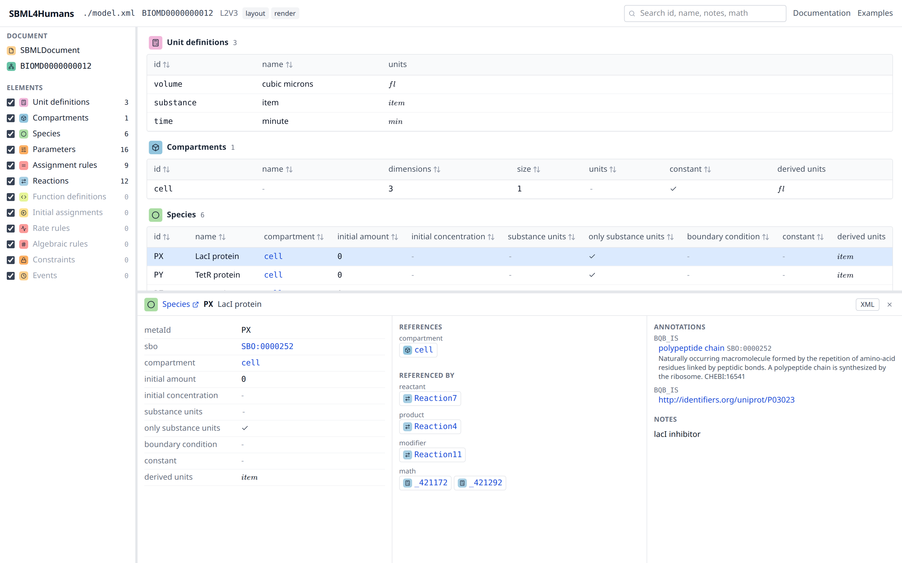

# sbml4humans

[SBML4Humans](https://sbml4humans.de) renders [SBML](sbml.md) models as interactive, human readable reports. Give it a model and it gives you a page which shows what the model contains: its compartments, species, reactions, rules and events, the mathematics of the model as typeset formulas, the units it computes from the file, the references between the elements, and the annotations resolved to the entries they point at.

## Why it exists

SBML is an XML format, and XML is written for programs. A model file states everything and shows nothing: the mathematics is content MathML, a unit is a product of base units spread over several elements, a species is a line of attributes among thousands of other lines, and an annotation is a URI in an RDF block. Reading a model in a text editor means reassembling it in your head, and a model of a genome scale reconstruction cannot be read that way at all.

The Google Summer of Code project which started this application was proposed because a human readable, interactive report which conveys the information and the content of an SBML model was urgently needed ([NRNB GoogleSummerOfCode issue #164](https://github.com/nrnb/GoogleSummerOfCode/issues/164)). That is what sbml4humans is: the view of a model which the file itself does not give you. It does not edit models and it does not simulate them, it reads them.

It is written for the people who have to read models rather than write them:

- modellers who open a model they did not build, or their own model after a year, and need to know what is in it
- reviewers and curators who check whether a model is annotated, whether its units are consistent and whether it says what the paper says
- students and lecturers who learn what SBML is, because every element of the report is explained where it is shown

## What a report shows

A report is one page per model. The rail on the left lists every element type with the number of elements of that type, the tables in the middle show the elements of each type with the columns which matter for that type, and the inspector shows one element in full: its attributes, everything it references and everything which references it, its notes, its annotations and its history, and the raw XML when that is what you need. Every column header, every attribute label, every mark of a type and every group of links carries a one sentence explanation on hover, and the type in the header of the inspector links its page in the reference.

[Reading a report](report.md) walks through all of it.

## Where to start

Open [sbml4humans.de](https://sbml4humans.de) and give it a model. There are three ways to do that, and an [examples](inputs.md#the-examples) page with models which are already there:

- upload an SBML file or a COMBINE archive from your computer
- give the url of a model, for example of an entry of BioModels
- paste the content of an SBML file

[Loading a model](inputs.md) explains the inputs, the formats which are accepted and what happens when a file cannot be read.

If a term of a report is unfamiliar, the [reference](reference/index.md) explains it: one page per element type with every attribute the report shows, the kinds of links between the elements, and what the report computes on top of the model. [SBML](sbml.md) is the background: what the format is, how a model is built from its elements, and what the Level 3 packages add.

## Funding and license

sbml4humans was started in 2021 as the project "Interactive SBML report for Humans" by Sankha Das, mentored by Matthias König and Ralf Steuer, as part of the Google Summer of Code programme of the [National Resource for Network Biology](https://nrnb.org/) (NRNB). It is developed at [github.com/matthiaskoenig/sbml4humans](https://github.com/matthiaskoenig/sbml4humans) under the MIT license, and it is funded by the German Research Foundation (DFG) within the Research Unit Programme FOR 5151 [QuaLiPerF](https://qualiperf.de).

The sources this documentation is written from are listed under [References](references.md).
