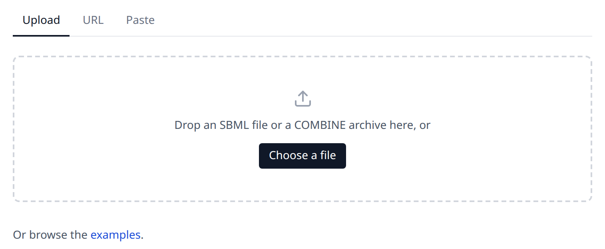
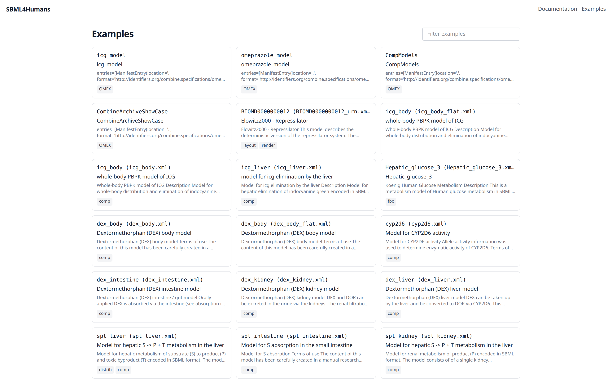

# Loading a model

A report is created from a model you provide. The home page offers three ways to do that, and the examples page offers models which are already there. A fourth way does not use the web application at all: the python package opens the report of a file on your own machine, as [Reports from python](python.md) describes. Whatever the input is, it is sent to the backend, which reads it with libsbml and answers with the data the report is built from. The file is written to a temporary file for that and is deleted with the request, it is not stored.

## The three inputs

The home page has a tab for each input: "Upload", "URL" and "Paste".

**Upload** takes a file from your computer. Drop it onto the dashed area or use "Choose a file" and pick it in the file dialog, which offers the extensions `.xml`, `.sbml`, `.gz`, `.omex` and `.zip`. The report opens as soon as it is created.

**URL** takes the web address of a model, for example the download link of a model of BioModels or the raw url of a file in a git repository. Enter it and press "Load"; the backend downloads the address, follows redirects and gives up after 60 seconds. The address you entered last is kept in your browser and is filled in the next time you open the page.

**Paste** takes the content of an SBML file as text. Paste the XML into the text area and press "Create report". This is the fastest way to look at a model which is in your clipboard or which you have just edited in a text editor.

## The accepted formats

The backend recognises three kinds of input, and it recognises them by their content, not by the name of the file:

| input | what it is |
| --- | --- |
| SBML | an XML file of any SBML level and version which libsbml can read |
| gzipped SBML | the same file compressed with gzip, which is how large models are usually shipped |
| COMBINE archive | a zip file with a manifest, usually with the extension `.omex`, holding one or more SBML files next to the other files of a study |

An SBML file is read as a single [document](reference/sbmldocument.md) with one [model](reference/model.md) in it. A COMBINE archive is read entry by entry: the report holds one report per SBML entry of the archive, and the context bar of the report switches between them, as [Reading a report](report.md#archives-and-models) describes. A file which is not an archive is read the same way; [COMBINE archives](sbml.md#combine-archives) says why. An archive is also what lets the report follow a model of the comp package into the other files it is built from: an external model definition is resolved against the other entries of its archive and never fetched, as [Models of other documents](report.md#models-of-other-documents) describes.

## The examples

The examples page lists the models the backend ships with, with a filter above the list which searches the id, the name and the description of an example. A card shows the id of the example, a name, a description and badges. For a model the name is the name of the model, the description is the first lines of its notes and the badges are the packages the file declares. For one of the four COMBINE archives the name is the file name without its extension, the description says how many SBML entries the archive holds and names them as long as the names stay short, and the single badge says `OMEX`.

The examples are of seven kinds:

- small models which each show one feature of SBML and are named after it, among them `algebraic_rule`, `notes`, `species`, `unit_definitions` and `distrib_uncertainties`
- small models written for the documentation, one per part of the data model which no published model of this list contains: `constraint_event`, a model of Level 3 Version 2 with a [constraint](reference/constraint.md) and its message, an [event](reference/event.md) whose trigger, priority and delay each carry an identifier, and a kinetic law with the list of [local parameters](reference/localparameter.md) of Level 3, which the curated models of Level 2 write in another list; `comp_deletion`, with the [deletions](reference/deletion.md), the [replacements](reference/replacedelement.md) and the chain of [references](reference/sbaseref.md) which reach into a submodel of a submodel; `fbc_bounds_v1` and `fbc_constraints_v3`, the [flux bound](reference/fluxbound.md) objects of fbc Version 1 and the [user defined constraints](reference/userdefinedconstraint.md) of Version 3; `qual_example`, a gene regulatory switch written with a logical and a Petri net [transition](reference/transition.md); `distrib_spans`, whose measurements are [intervals](reference/uncertspan.md) and distributions; and `list_of`, whose [lists](reference/listof.md) carry notes, an annotation, an SBO term, an id and a name of their own, one of them an empty list of rules with a note which says why
- published models, for example the repressilator, a model of hepatic glucose metabolism, and the physiologically based models of indocyanine green, dextromethorphan and sparteine, which use the comp package to build a body out of organ models
- published logical models which use the qual package, written by [TabularQual](https://github.com/sys-bio/TabularQual): `Faure2006`, the Boolean model of the mammalian cell cycle, in which every [input](reference/input.md) of a [transition](reference/transition.md) carries its sign, and `ThieffryThomas1995_multivalue`, the decision between lysis and lysogeny of the phage lambda, whose [qualitative species](reference/qualitativespecies.md) have up to four levels
- constraint based reconstructions which use the fbc package: the core model of *E. coli* and Recon3D, the human reconstruction, which is large enough to show what a report does with tens of thousands of elements
- the first curated models of [BioModels](https://www.ebi.ac.uk/biomodels/), each read from its COMBINE archive
- four COMBINE archives, among them `CompModels`, which holds several SBML entries and is the example to look at when you want to see how an archive is shown

The kinds overlap: the repressilator is listed twice, once as the published model `BIOMD0000000012 (BIOMD0000000012_urn.xml)`, whose annotations are written as MIRIAM URNs, and once as the curated BioModels entry `BIOMD0000000012`, read from its archive.

The id of an example which is a model is the id of the model with the name of its file behind it, for example `icg_body (icg_body.xml)`; a model of BioModels keeps its accession, for example `BIOMD0000000012`; an archive is named by its file without the extension, for example `CompModels`. An example opens at the address `/examples/<id>`, so a report of an example can be linked and bookmarked.

## Sharing a report

A report which was created from a url keeps that url in its own address, as `/report?url=<the url of the model>`. Anyone who opens that address gets the same report, because the backend downloads the model again. The state of the report, that is the selected element, the search and the filter of types, is part of the address as well; [The url of a report](report.md#the-url-of-a-report) lists the parameters.

A report which was created from an upload or from pasted content cannot be shared this way, because the model exists only in the browser tab it was loaded in. Reloading such a page shows "No report loaded" and the link back to the home page.

## When a model cannot be read

The application shows what went wrong instead of an empty report. The message comes from the backend and the errors of libsbml are part of it, so a file which is not valid SBML is reported with the line and the reason libsbml gives:

- a file which contains no model at all is reported as "No SBML model could be read", followed by the error log of libsbml
- a url which answers with an error is reported with the status of the request; a url which cannot be reached at all, or which is still downloading after 60 seconds, is reported without one
- a backend which is not running is reported as not reachable, which is what a local development setup shows when only the frontend was started

"Show details" below the message opens the full traceback of the backend, which is worth reading when the message alone does not say enough, and worth including when you report a problem.

Warnings of libsbml do not stop a report. A model which libsbml reads despite its errors is shown, with the elements it could read.
