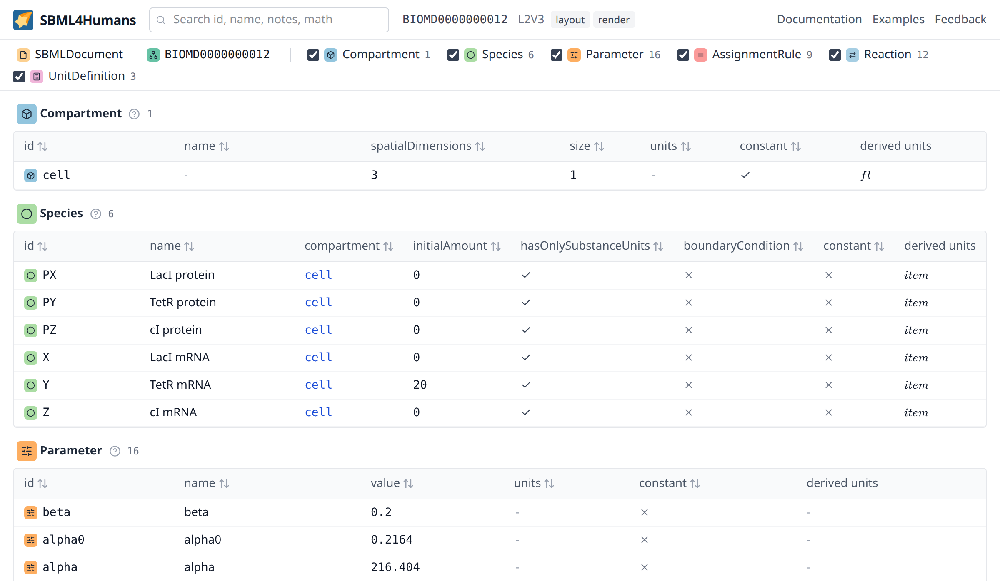
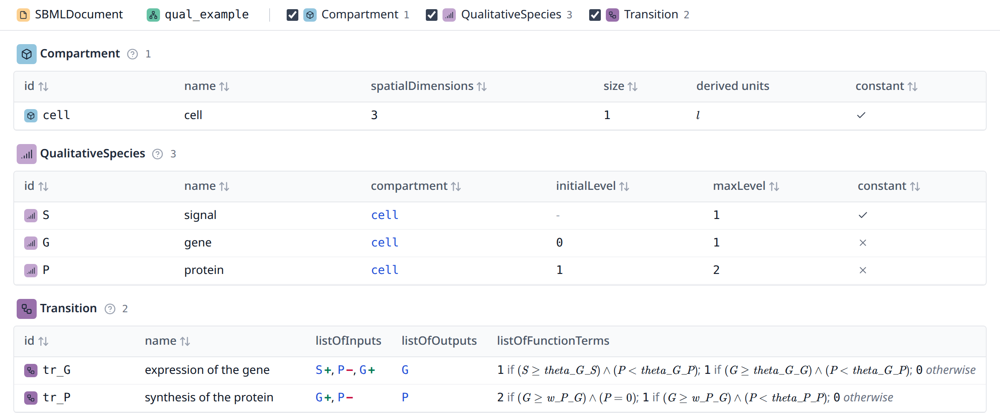
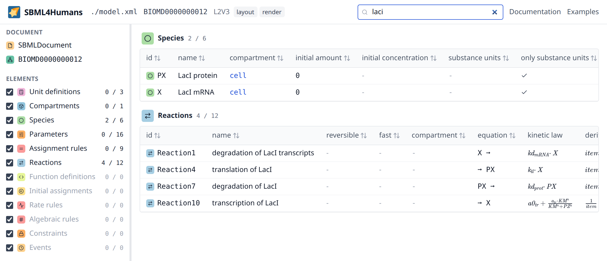
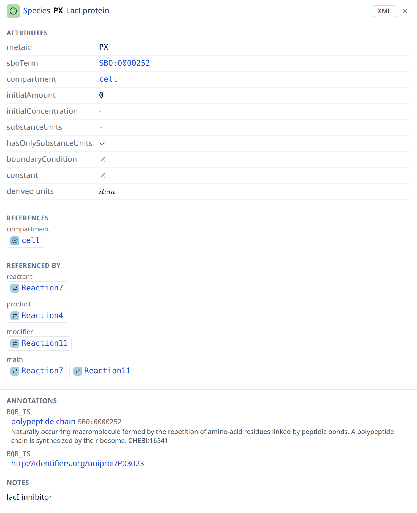
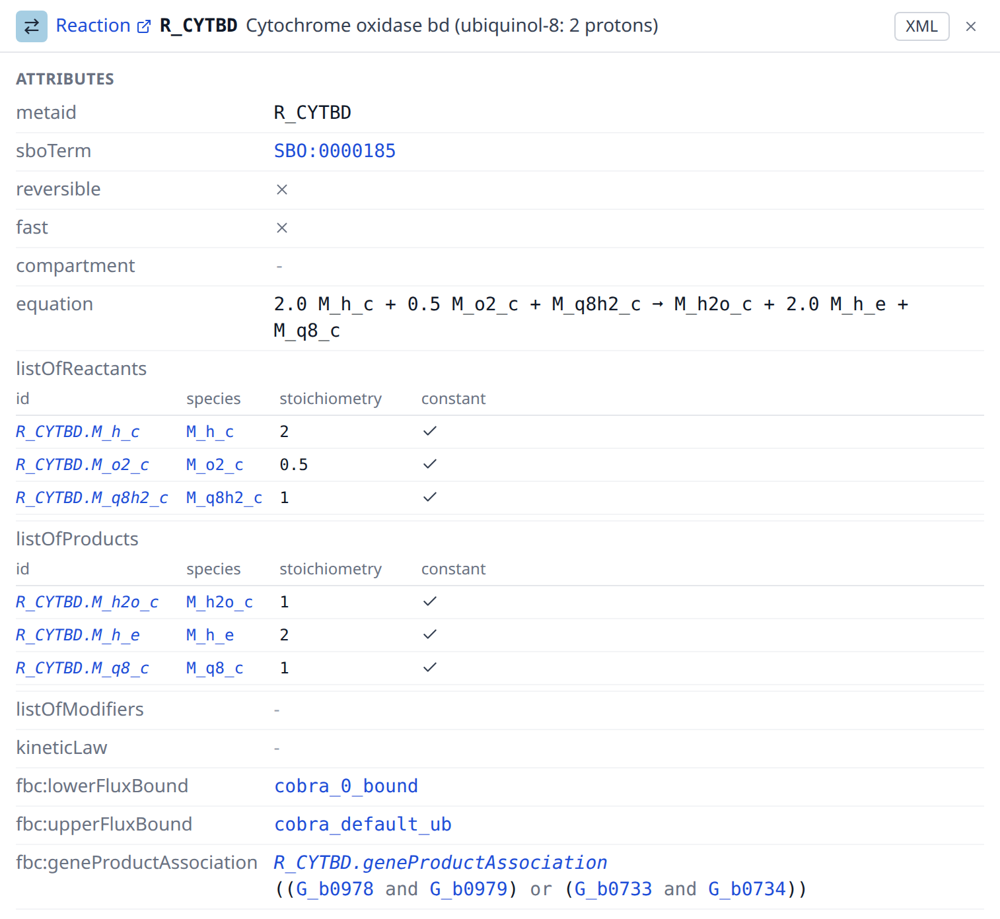
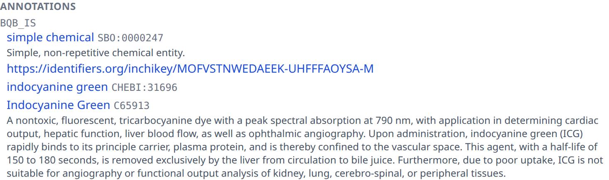
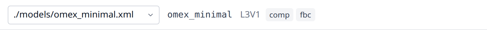

# Reading a report

A report shows one [model](reference/model.md) of one SBML file at a time. The type bar at the top says what the model is made of, the tables under it show the elements of every type, and the inspector at the right shows one element in full. The whole model is on the page, the three parts are three views of it.

The tables and the inspector are the two panes of one split: the inspector is there while an element is selected, and it opens at a third of the window. The divider between them is dragged with the pointer, or moved with the arrow keys once it has the focus, and the width it is left at is the width the inspector opens with in the next report.

## The type bar

The bar over the tables lists what the file contains, as one row which wraps onto as many lines as the model needs.

It begins with the [document](reference/sbmldocument.md) itself, the model which is currently shown, and the [external model definitions](reference/externalmodeldefinition.md) of a file which uses the comp package. A click selects the element and opens it in the inspector, which is how the level, the version, the packages and the units of a model are read.

A separator follows, and after it one entry per element type: a checkbox, the coloured mark of the type, its name in the plural and the number of elements of that type. A type the model has no element of is not in the bar at all, and the types of a package are there only when the file declares that package, so the bar is the answer to what a model is made of.

Three things can be done with such an entry. The name scrolls the tables to the section of that type, as far as there is one: a type whose checkbox is off or whose elements a search filtered away has no section to scroll to. The checkbox hides that section, which is the filter of types, and the state of the checkboxes is part of the url of the report. The count shows the number of elements, and while a search is active it shows the number of matching elements in front of the total.

Hovering the mark of a type shows one sentence explaining what the type is. It is the same sentence the [reference](reference/index.md) page of that type begins with.

## The element tables

Every type with at least one element gets a section: the mark of the type, its name, the number of elements and a table.

The columns of a table are those of the type, the attributes of the core and of the packages together, and every table starts with the id and the name of its elements:

- a table of [species](reference/species.md) has the [compartment](reference/compartment.md), the chemical formula and the charge which fbc adds, the initial amount, the initial concentration, the substance units, the flags for only substance units, boundary condition and constant, and the derived units
- a table of [reactions](reference/reaction.md) has the reversible flag, the fast flag, the compartment, the equation, the lower and the upper flux bound, the [gene association](reference/geneproductassociation.md), the [kinetic law](reference/kineticlaw.md) and the derived units of that law
- a table of [assignment rules](reference/assignmentrule.md) has the variable, the formula and the derived units of the formula
- a table of [qualitative species](reference/qualitativespecies.md) has the compartment, the initial level, the maximum level and the constant flag, which together are the state space of a qualitative model
- a table of [transitions](reference/transition.md) has the species of its [inputs](reference/input.md) with the sign of each influence, the species of its [outputs](reference/output.md) and the number of its [function terms](reference/functionterm.md), which puts the influence of a transition on one line
- a table of [objectives](reference/objective.md) has the type and the [flux objectives](reference/fluxobjective.md) as the sum they are, `1 × EX_biomass` or `4 × v1 × v2`, which is what a flux balance analysis optimises, and a table of [user defined constraints](reference/userdefinedconstraint.md) has the two bounds and the weighted sum they keep between them

A column which no row of the table fills is left out of it, so that a table shows what its model uses rather than what its type may carry. The flux bounds and the gene association of a reaction are in the table of a constraint based model and in no other, the initial concentration is in the table of a model which states one, and a model of Level 3 Version 2, which has no fast flag, does not carry that column. A reaction of Level 1 or 2 which does not write the flag has the default of its level, which is `false` from Level 2 Version 2 on. The decision is made over every row of the type and not over the rows a search leaves, so that a column does not come and go while a reader types, and a column of flags stays as soon as one row states one, because `false` is a value and an attribute which is not set is not.

The [reference](reference/index.md) page of a type explains every attribute the report shows for it, in two tables: the attributes the specification gives the type, and the fields the report computes on top of them. The columns of the table are spread over both tables, and the id and the name, with which every table starts, are explained once for all types on the [SBase](reference/sbase.md) page which every type page links. Hovering a column header shows the same explanation as one sentence.

The id of a row carries the mark of the type of that row, the same mark the type bar and the inspector use, so a row says on its own which kind of element it is, which matters where tables look alike, as the tables of the rules do. An element which the file gives no id, as most [initial assignments](reference/initialassignment.md), rules and constraints of a curated model, shows the name the report gives it instead, set in italics so that it is told apart from an id the file writes: the element it sets for an assignment or a rule, the meta id or the place of a constraint. It is the same name the inspector and every link use, and the column sorts by it.

The values are shown as what they are. A boolean is a check for true and a thin cross for false, and the dash of an attribute the file does not set is a third thing, a reference to another element is a link, a unit is rendered as a formula next to the identifier of the [unit definition](reference/unitdefinition.md) it comes from, a formula is typeset the way a textbook would print it instead of as the MathML of the file, and the assignments of an [event](reference/event.md) are the elements they set and the formulas they assign, not their number. The gene association of a reaction is the expression its tree stands for, with every gene a link, and the inputs and outputs of a transition are the qualitative species they name, an input with the sign of its influence behind it. A [number](reference/concepts.md#number) which the file writes as infinite reads as the sign of infinity, ∞ or -∞, which a reader can tell from the dash of an attribute the file does not set. Three columns are computed by the report rather than read from the file: the [derived units](reference/concepts.md#derived-units) of a quantity or of a formula, the [equation](reference/concepts.md#equation) of a reaction, which is the fastest way to read a list of reactions, and the [rendered units](reference/concepts.md#rendered-units) which fill the units column of the table of unit definitions.

A click on a column header sorts the table by that column, a second click reverses the order. Empty values sort to the end in both directions, an infinite value sorts where the number it stands for belongs, and text sorts with numbers in mind, so `x2` comes before `x10`. A column which holds rendered content rather than a value cannot be sorted: the rendered mathematics, a column which holds nothing but rendered units, such as the units of a unit definition or the derived units of an element, the assignments of an event, the gene association of a reaction, the inputs and outputs of a transition, the flux objectives of an objective, the components of a user defined constraint and the deletions of a submodel, which are trees and lists of elements rather than something to order rows by. A units column which names a unit definition, for example the substance units of a species or the units of a [parameter](reference/parameter.md), sorts by that identifier like any other link.

A click on a row opens that element in the inspector, a click on the selected row closes it again. A click on a link inside a row follows the link instead and selects the element the link points at, and a click on a rendered formula copies the formula as text instead of selecting the row. With the keyboard, the arrow keys move from row to row and Enter or Space selects the row.

A table with more than 200 rows shows 15 rows in a scroll area of its own and renders only the rows which are in view. This keeps a reconstruction such as Recon3D, which has tens of thousands of elements, as fast as a small model. Sorting, selecting and searching work the same in such a table.

A table which is wider than the pane it is in scrolls sideways inside its section, which the wide tables, the species and the reactions of a model, do while the inspector takes its third of the window. Dragging the divider or closing the inspector gives them the width back, which is all the tables of most models need; the species and the reactions of a genome scale model, with the columns of fbc next to those of the core, are wider than a window of a laptop and scroll even then.

## Searching

The search box next to the logo filters every table at once. It matches the text of an element without regard to case: the id, the name, the meta id, the SBO term, the symbol or the variable an assignment or a rule sets and the name of that element, the text of the notes and of the message of a constraint, the formulas of the element and of what it holds, such as the trigger of an event or the terms of a transition, the equation of a reaction and the label of a gene product. The elements a row holds are part of it: the id and the name of a species reference, a local parameter, an input, an output, a term, a deletion or an assignment find the row which holds them, what a replacement names inside a submodel finds the element which carries it, and the names, the notes and the measures of the [uncertainties](reference/uncertainty.md) of an element find that element. A rule which carries no identifier of its own is therefore found by the name of the element it sets.

While a search is active, every table shows only the matching rows, a type without a match disappears from the tables, and the type bar counts the matches of every type in front of its total. `Esc` in the box clears the search. The search text is part of the url of the report.

## The inspector

The inspector opens at the right of the tables for the selected element and shows everything the report has about it.

Its header carries the mark and the name of the type, the id of the element, its name, and two buttons, on one line. The name of the type is a link into the [reference](reference/index.md) of this documentation, which explains the type and all of its attributes. An element which the file gives no id is named by the name the report gives it, in italics. Where the inspector is too narrow for all of it, the name of the element gives way first and the end of the name of the type after it, whose mark names it on hover. The "XML" button switches the inspector to the XML of the element, and the cross closes it.

Below the header are three sections, one under the other in one scroll, each parted from the next by a hairline. A reader who drags the inspector wider than about 900 px gets the three next to each other instead, a column each with a scroll of its own.

**Attributes** lists what the file states about the element: the meta id, the SBO term as a link to its entry in the Systems Biology Ontology, and then the attributes of its type, for example the compartment, the initial amount and the units of a species, or the reversible flag, the reactants, the products, the modifiers and the kinetic law of a reaction. Hovering the label of a row shows what the attribute means, and hovering the header of a column of a small table what the column holds. A formula which is too long to typeset is shown as its text, shortened. The rows which show the formula of the element itself, among them the math of a rule, the kinetic law of a reaction and the condition of a [trigger](reference/trigger.md), carry a "render formula" button below the text, which typesets it anyway; in a cell of a table and in the small tables inside the inspector the shortened text is all there is.

A list inside an element is shown as a small table of its own: the [event assignments](reference/eventassignment.md) of an [event](reference/event.md), the [flux objectives](reference/fluxobjective.md) of an [objective](reference/objective.md), the [units](reference/unitdefinition.md) a unit definition is built from, the [deletions](reference/deletion.md) of a [submodel](reference/submodel.md), the [replaced elements](reference/replacedelement.md) an element takes the place of, and the [uncertainties](reference/uncertainty.md) of a value, each named with a link to it and with the table of the measures it collects, in which an [uncert span](reference/uncertspan.md) reads as the interval it is, so that how well a value is known is read where the value is. The inspector of a [transition](reference/transition.md) is three such tables, its inputs, its outputs and its terms with the [default term](reference/defaultterm.md) as the last row, which together are the transition table of a qualitative model. The tables one element shows under each other, the reactants, the products and the modifiers of a reaction, the inputs and the outputs of a transition and the measures of its uncertainties, line up their columns. A row of a small table names its element as every link does, and a small table which is wider than the inspector scrolls inside it, the way a wide element table scrolls in its section.

An element which the file nests in another is a link in the row which shows it, because it is an element of the report with attributes, notes and annotations of its own: the [kinetic law](reference/kineticlaw.md) of a reaction, the [trigger](reference/trigger.md), the [priority](reference/priority.md) and the [delay](reference/delay.md) of an event, every [species reference](reference/speciesreference.md) of a reaction, and the [gene product association](reference/geneproductassociation.md) of a reaction of a constraint based model. The association is written as the expression its tree stands for, with every gene a link to its [gene product](reference/geneproduct.md), so that the two complexes which each catalyse the cytochrome oxidase reaction of the *E. coli* core model read as one line; a group of more than five nodes and a group nested more than two operators deep open on a click, so that an association of thousands of genes stays a few lines instead of a wall.

**Links** answers where an element is used. "References" lists the elements this element names, "Referenced by" lists the elements which name it, and both are grouped by the kind of the link: the compartment of a species, the reactants of a reaction, the variable of a rule, the units of a parameter, the elements a formula uses, and so on. Every link starts at the element which carries the reference, so a reaction names its species references and each of them names its species. The groups of a reaction and of a species look across that step, which is the question a reader asks: the reactants of a reaction are the species it consumes, and a species lists the reactions which consume, produce or modify it. The species references themselves are listed in the attributes of their reaction, and their own inspector shows both of their links. The formula of a reaction is looked across the same way: the reaction names its [kinetic law](reference/kineticlaw.md) and lists what the formula reads under "math", and a species or a parameter the formula reads lists the reaction there, not the kinetic law; a [transition](reference/transition.md) and the function terms of its table are shown alike. The genes of a reaction are looked across its [gene product association](reference/geneproductassociation.md): the reaction lists the [gene products](reference/geneproduct.md) its tree names, and a gene product lists the reactions which need it, each of them once, which is the question a reader of a reconstruction asks of a gene. An [uncertainty](reference/uncertainty.md) names the element whose value it describes, so the link leads back from the measures to the value. An element which the file nests in another one and which carries no id of its own is named after that element and its place in it, `Reaction1.kineticLaw`, `Start.trigger`, `Start.kp` for an assignment of the event `Start`, `R_PFK.G_b3916` for a gene of the association of `R_PFK` or `biomass_max.EX_biomass` for a flux objective, where its meta id would say nothing, and the name is set in italics wherever it stands, as a name the report gives and not an id of the file. The [link kinds](reference/links.md) page explains every kind, and hovering the label of a group shows its explanation. Every entry is a link which selects that element, so a model can be walked through along its references. A group with more than 50 entries shows the first 50 and a button for the rest, which matters for a compartment of a genome scale model.

**Annotations** shows the metadata of the element.

The annotations themselves are the controlled vocabulary terms of the element, one block per term, headed by the qualifier of that term, with its resources below it. An element with two terms of the same qualifier therefore shows two blocks under the same heading, and a term which further terms qualify, which the specification allows at any depth, shows them indented below its resources. Each resource is a link to the entry it identifies, and the report asks its backend what the entry is, so that a resource shows the name of the molecule, of the pathway or of the publication instead of an identifier alone. A term of the Systems Biology Ontology which the element carries is listed here as well. Long lists of terms and of resources are cut off, with one button which shows the rest and one which resolves the rest.

The notes of the element follow, rendered as the XHTML the author wrote, and the history of the SBML encoding last: who created it, with which organization and mail address, when it was created and when it was modified.

The "XML" button in the header replaces the three sections by the SBML of the element as it stands in the file, with a button which copies it. It is there for what a report cannot show better than the file itself: an annotation in a format the report does not read, an element of a package it does not support, or simply the exact text. The button is there for every element, including the document and the model, whose XML would be the whole file: for those two the view shows their annotation element alone, under a caption which says so, because that is where a tool writes what a file says about itself, and it says that the element carries no annotation where there is none.

## Archives and models

The bar at the top says which file and which model the report shows: the entry of the COMBINE archive, the model inside it, the level and the version of SBML and the packages the file declares. A model which was not submitted as an archive is wrapped in one by the backend, under a location the reader never chose; that single entry is not written in the bar, which then begins with the model.

An archive with more than one SBML entry offers its entries for selection, named by their location in the archive. The report opens the master entry of the manifest when that entry has a report of its own, and the first entry otherwise; an archive does not have to mark a master entry, and `CompModels`, one of the example archives, marks none. A file which uses the comp package can hold model definitions next to its model; they are offered in the same way, with "(definition)" behind the id of a model definition, and the report opens the model of the document first. A [submodel](reference/submodel.md) is an element of the model which instantiates it, and the model definition it instantiates is one of the models offered here.

Switching the entry or the model closes the inspector, because the selected element belongs to the model it was selected in. The search and the filter of types stay as they are.

## The url of a report

The state of a report is part of its address, so a report can be linked in the state it is in: a selected element, a search, a filter of types, one entry of an archive and one model of a document.

| parameter | meaning |
| --- | --- |
| `pk` | the selected element, given by its [primary key](reference/concepts.md#primary-key), which the report builds for every element because not every element of SBML has an id |
| `q` | the text of the search |
| `types` | the types the tables show, separated by commas; without the parameter every type is shown |
| `entry` | the location of the SBML entry inside the COMBINE archive |
| `model` | the id of the model or of the model definition |
| `url` | the address the model was downloaded from, for a report which was loaded from a url |

Selecting an element adds a step to the history of the browser, so the back button walks back through the elements you looked at. Typing in the search box does not, so the back button does not step through every keystroke.
