# Reading a report

A report shows one [model](reference/model.md) of one SBML file at a time. The type bar at the top says what the model is made of, the tables under it show the elements of every type, and the inspector at the right of them shows one element in full. The whole model is on the page, the three parts are three views of it.

[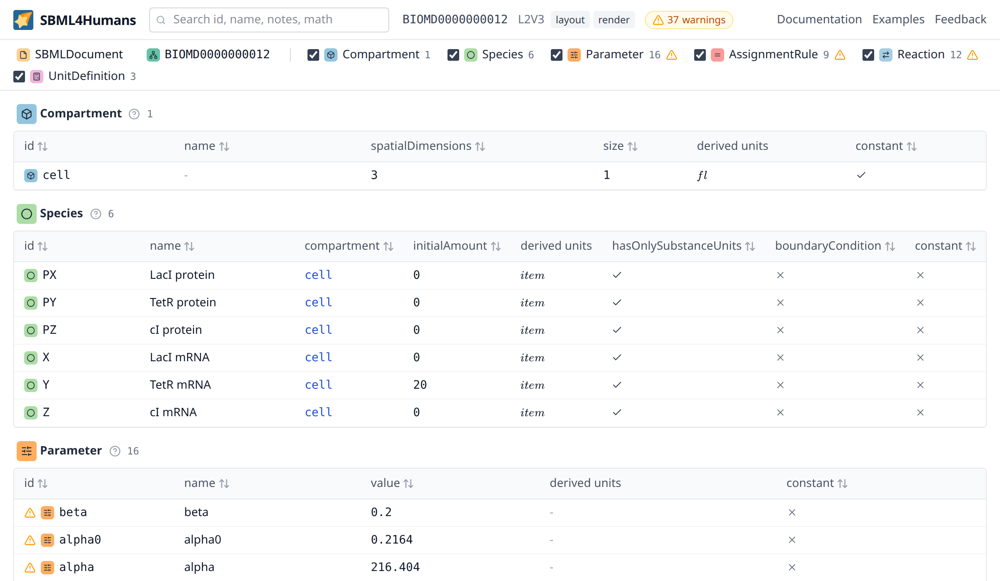](images/report-tables.png)

The tables and the inspector are the two panes of one split: the inspector is there while an element is selected, and it opens at a third of the window. The divider between them is dragged with the pointer, or moved with the arrow keys once it has the focus, and the width it is left at is the width the inspector opens with in the next report.

## The type bar

The bar over the tables lists what the file contains, as one row which wraps onto as many lines as the model needs.

It begins with the [document](reference/sbmldocument.md) itself, the model which is currently shown, and the [external model definitions](reference/externalmodeldefinition.md) of a file which uses the comp package. A click selects the element and opens it in the inspector, which is how the level, the version, the packages and the units of a model are read.

A separator follows, and after it one entry per element type: a checkbox, the coloured mark of the type, its name and the number of elements of that type. The types stand in the order in which the specification lists them in a model, with one exception: the [unit definitions](reference/unitdefinition.md) come last, in the bar and in the tables, because they are what the other tables link to for their units and not what a model is about. A type the model has no element of is not in the bar at all, and the types of a package are there only when the file declares that package, so the bar is the answer to what a model is made of.

Three things can be done with such an entry. The name scrolls the tables to the section of that type, as far as there is one: a type whose checkbox is off or whose elements a search filtered away has no section to scroll to. The checkbox hides that section, which is the filter of types, and the state of the checkboxes is part of the url of the report. The count shows the number of elements, and while a search is active it shows the number of matching elements in front of the total.

Hovering the mark of a type shows one sentence explaining what the type is. It is the same sentence the [reference](reference/index.md) page of that type begins with.

## The element tables

Every type with at least one element gets a section: the mark of the type, its name, the number of elements and a table.

The rows of a table are the elements of one list of the model, the species of its `listOfSpecies`, and SBML lets a file say something about the list itself: a note on where the species come from, an annotation which holds for all of them, an SBO term, an id or a name. A [list](reference/listof.md) which states something of its own is an element of the report, and the heading of its table links it behind the number of elements, by its id or by the name it has in the file. The three tables of the rules share the one `listOfRules`, so all three link it. Most models say nothing on their lists, and their headings carry no link.

The report names things as the specification does. A type is written as the name of its class, `FunctionDefinition` or `AssignmentRule`, in the type bar, over its table, in the header of the inspector and in the [reference](reference/index.md). An attribute is written as the file writes it, `initialConcentration`, `hasOnlySubstanceUnits` or `listOfReactants`, as the header of a column, as the label of a row of the inspector and in the reference, and an attribute which a package adds to a type of the core carries the prefix of the package, `fbc:charge` or `comp:replacedBy`. So a name which is read in a report is the name to look for in the specification, in the XML of the file and in the API of a library such as libsbml. What the report adds itself is written in plain words and is told apart by that: the [derived units](reference/concepts.md#derived-units), the [equation](reference/concepts.md#equation) of a reaction or the status of an external model definition. The groups of the links in the inspector are named after the attribute which makes the reference, without a prefix: `compartment`, `kineticLaw`, `lowerFluxBound`.

The columns of a table are those of the type, the attributes of the core and of the packages together, and every table starts with the id and the name of its elements:

- a table of [species](reference/species.md) has the [compartment](reference/compartment.md), the chemical formula and the charge which fbc adds, the initial amount, the initial concentration, the derived units right of them, and the flags for only substance units, boundary condition and constant
- a table of [reactions](reference/reaction.md) has the reversible flag, the fast flag, the compartment, the equation, the lower and the upper flux bound, the [gene association](reference/geneproductassociation.md), the [kinetic law](reference/kineticlaw.md) and the derived units of that law
- a table of [assignment rules](reference/assignmentrule.md) has the variable, the formula and the derived units of the formula
- a table of [qualitative species](reference/qualitativespecies.md) has the compartment, the initial level, the maximum level and the constant flag, which together are the state space of a qualitative model
- a table of [transitions](reference/transition.md) has the species of its [inputs](reference/input.md) with the sign of each influence, the species of its [outputs](reference/output.md) and its [function terms](reference/functionterm.md) with their math, `level if condition` for every term and `level otherwise` for the [default term](reference/defaultterm.md), which puts the influence and the rule of a transition on one line
- a table of [objectives](reference/objective.md) has the type and the [flux objectives](reference/fluxobjective.md) as the sum they are, `1 × EX_biomass` or `4 × v1 × v2`, which is what a flux balance analysis optimises, and a table of [user defined constraints](reference/userdefinedconstraint.md) has the two bounds and the weighted sum they keep between them

[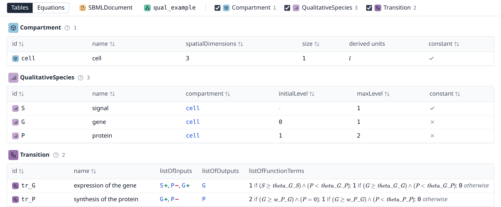](images/report-qual.png)

A column which no row of the table fills is left out of it, so that a table shows what its model uses rather than what its type may carry. The flux bounds and the gene association of a reaction are in the table of a constraint based model and in no other, the initial concentration is in the table of a model which states one, and a model of Level 3 Version 2, which has no fast flag, does not carry that column. A reaction of Level 1 or 2 which does not write the flag has the default of its level, which is `false` from Level 2 Version 2 on, and the fast column is shown only when a reaction of the model is fast: a column of that default in every row says nothing, while a single fast reaction is what a reader has to see. The decision is made over every row of the type and not over the rows a search leaves, so that a column does not come and go while a reader types, and any other column of flags stays as soon as one row states one, because `false` is a value and an attribute which is not set is not.

The [reference](reference/index.md) page of a type explains every attribute the report shows for it, in two tables: the attributes the specification gives the type, and the fields the report computes on top of them. The columns of the table are spread over both tables, and the id and the name, with which every table starts, are explained once for all types on the [SBase](reference/sbase.md) page which every type page links. Hovering a column header shows the same explanation as one sentence, and the help icon next to it opens the whole [explanation](#explanations) in the report.

The id of a row carries the mark of the type of that row, the same mark the type bar and the inspector use, so a row says on its own which kind of element it is, which matters where tables look alike, as the tables of the rules do. An element which the file gives no id, as most [initial assignments](reference/initialassignment.md), rules and constraints of a curated model, shows the name the report gives it instead, set in italics so that it is told apart from an id the file writes: the element it sets for an assignment or a rule, the meta id or the place of a constraint. It is the same name the inspector and every link use, and the column sorts by it.

The values are shown as what they are. A boolean is a check for true and a thin cross for false, and the dash of an attribute the file does not set is a third thing, a reference to another element is a link, a unit is rendered as a formula, a formula is typeset the way a textbook would print it instead of as the MathML of the file, and the assignments of an [event](reference/event.md) are the elements they set and the formulas they assign, not their number. The gene association of a reaction is the expression its tree stands for, with every gene a link, and the inputs and outputs of a transition are the qualitative species they name, an input with the sign of its influence behind it. A [number](reference/concepts.md#number) which the file writes as infinite reads as the sign of infinity, ∞ or -∞, which a reader can tell from the dash of an attribute the file does not set. Three columns are computed by the report rather than read from the file: the [derived units](reference/concepts.md#derived-units) of a quantity or of a formula, the [equation](reference/concepts.md#equation) of a reaction, which is the fastest way to read a list of reactions, and the [rendered units](reference/concepts.md#rendered-units) which fill the units column of the table of unit definitions. The derived units are the only units of a table and stand in the column right of the value they belong to, the size of a compartment, the value of a [parameter](reference/parameter.md) or the initial amount and concentration of a species, so that a value is read together with its units. The units attribute which the file writes is a row of the inspector.

A click on a column header sorts the table by that column, a second click reverses the order. Empty values sort to the end in both directions, an infinite value sorts where the number it stands for belongs, and text sorts with numbers in mind, so `x2` comes before `x10`. A column which holds rendered content rather than a value cannot be sorted: the rendered mathematics, a column which holds nothing but rendered units, such as the units of a unit definition or the derived units of an element, the assignments of an event, the gene association of a reaction, the inputs and outputs of a transition, the flux objectives of an objective, the components of a user defined constraint and the deletions of a submodel, which are trees and lists of elements rather than something to order rows by.

A click on a row opens that element in the inspector, a click on the selected row closes it again. A click on a link inside a row follows the link instead and selects the element the link points at, and a click on a rendered formula copies the formula as text instead of selecting the row. With the keyboard, the arrow keys move from row to row and Enter or Space selects the row.

A table with more than 200 rows shows 15 rows in a scroll area of its own and renders only the rows which are in view. This keeps a reconstruction such as Recon3D, which has tens of thousands of elements, as fast as a small model. Sorting, selecting and searching work the same in such a table.

A table which is wider than the pane it is in scrolls sideways inside its section, which the wide tables, the species and the reactions of a model, do while the inspector takes its third of the window. Dragging the divider or closing the inspector gives them the width back, which is all the tables of most models need; the species and the reactions of a genome scale model, with the columns of fbc next to those of the core, are wider than a window of a laptop and scroll even then.

## Searching

The search box next to the logo filters every table at once. It matches the text of an element without regard to case: the id, the name, the meta id, the SBO term, the symbol or the variable an assignment or a rule sets and the name of that element, the text of the notes and of the message of a constraint, the formulas of the element and of what it holds, such as the trigger of an event or the terms of a transition, the equation of a reaction and the label of a gene product. The elements a row holds are part of it: the id and the name of a species reference, a local parameter, an input, an output, a term, a deletion or an assignment find the row which holds them, what a replacement names inside a submodel finds the element which carries it, and the names, the notes and the measures of the [uncertainties](reference/uncertainty.md) of an element find that element. A rule which carries no identifier of its own is therefore found by the name of the element it sets.

[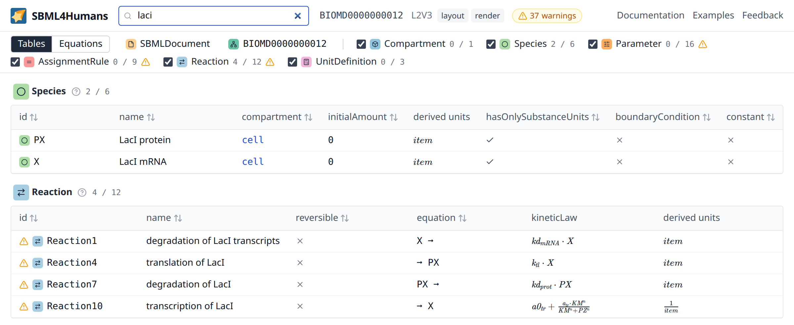](images/report-search.png)

While a search is active, every table shows only the matching rows, a type without a match disappears from the tables, and the type bar counts the matches of every type in front of its total. `Esc` in the box clears the search. The search text is part of the url of the report.

## The equations

A model of SBML describes a system of ordinary differential equations, and the switch "Tables | Equations" at the start of the type bar shows it in place of the tables. The view writes the model as it would be printed in a paper, from the definitions to the system: first the constructs the system leaves out, if there are any, then the [function definitions](reference/concepts.md#function-definitions), the [assignment rules](reference/concepts.md#assignment-rules) in the order of their dependencies, the [reaction rates](reference/concepts.md#reaction-rates), the [ODE system](reference/concepts.md#ode-system) with the rate of change of every state, the [initial assignments](reference/concepts.md#initial-assignments) which are given by a formula and the [events](reference/concepts.md#events). A section without an equation is left out.

[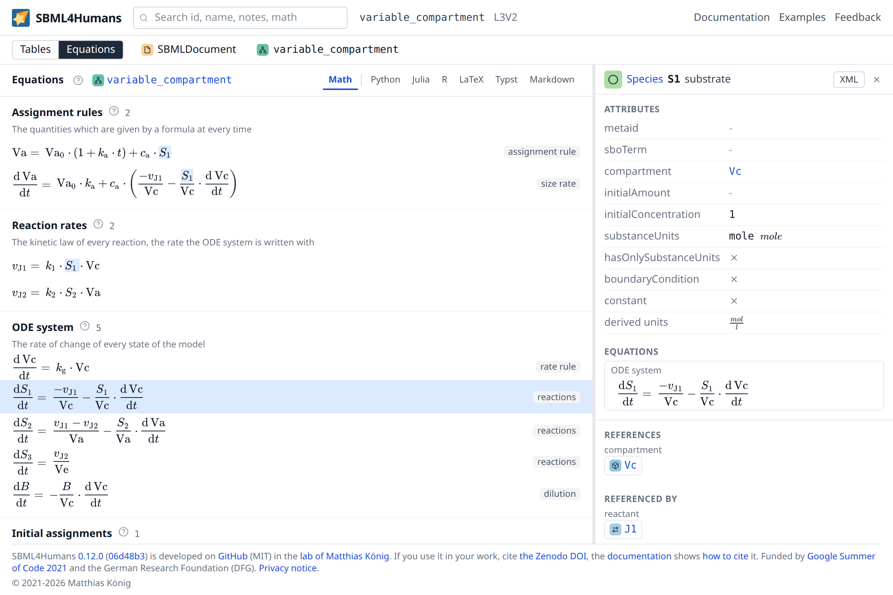](images/report-equations.png)

Every symbol of an equation stands for an element of the model: a click on it opens the element in the inspector, and the symbols of the selected element are marked in every equation, so that where a species or a parameter is used shows at a glance. The inspector of a species, a reaction, a parameter or a compartment shows the equation of the element below its attributes, with a link which opens it in the view. Every species is a state in the quantity the model declares, its amount or its concentration. The rate of change of a species in concentration is divided by the size of its compartment, and in a compartment whose size changes it is diluted by the rate of the size, as SBML Level 3 Version 2 (section 3.4.6) describes it: the rate of a size with a rate rule is that rule, the rate of a size with an assignment rule is the derivative of the rule, an assignment of its own. A conversion factor multiplies the rates of the reactions of a species, and an event which changes a size converts the concentrations in it to the new size.

A model with an algebraic rule, a `delay` or a fast reaction is no ODE system, and the view names these constructs above the equations, which are then not the whole model. A model with submodels is flattened first; an external model is read from the other files of the report, never from anywhere else. Where the system cannot be built, the view says why in place of the equations, and the tables are not affected.

The tabs at the top of the view show the math or the [code](reference/concepts.md#code) of the system: python, julia or R code with the ODE system as functions of the time, the states and the constants, or a LaTeX, typst or markdown document, highlighted, to copy or to download. The equations and the code are written by [sbmlode](https://matthiaskoenig.github.io/sbmlode/), which also writes custom exports, code which integrates the model for example, linked from the toolbar of the code.

[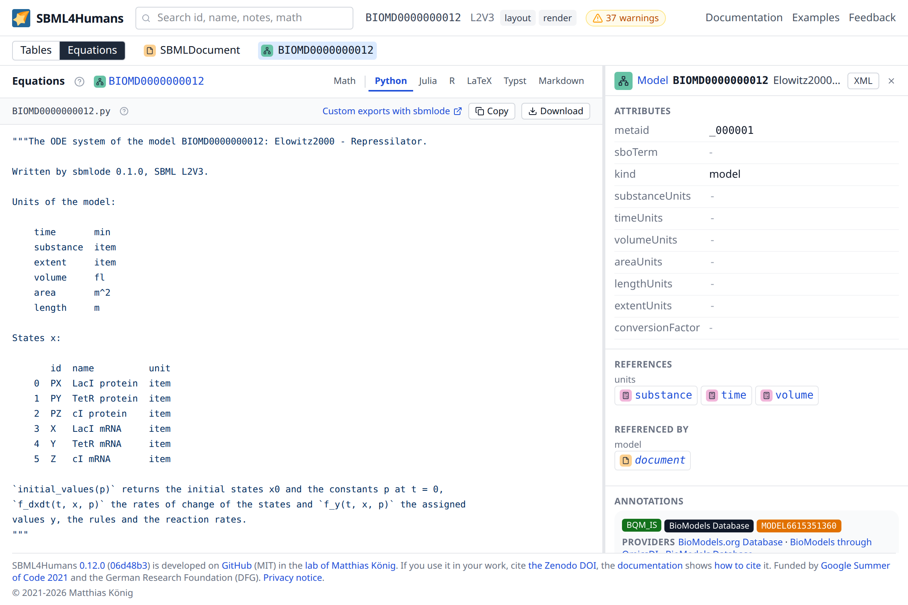](images/report-equations-code.png)

The view and its tab are part of the url of the report (`view=equations`, `code=python`), and a search, which filters the tables, switches back to them.

## The inspector

The inspector opens at the right of the tables for the selected element and shows everything the report has about it. A report opens with its model selected, so the first thing a reader sees next to the tables is what the model is: its name, its units, its annotations and its notes. The cross of the inspector closes it, and it stays closed until an element is selected.

[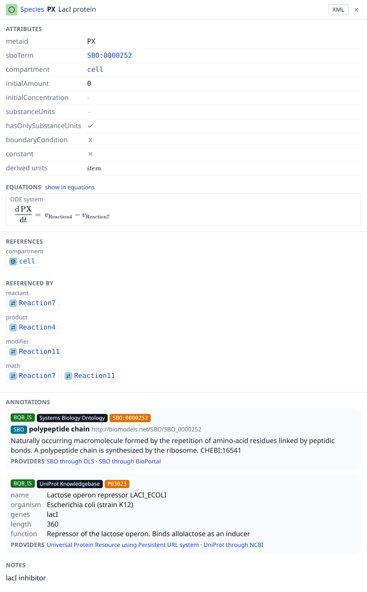](images/inspector-species.png)

Its header carries the mark and the name of the type, the id of the element, its name, and two buttons, on one line. The name of the type opens what the type is, as every name of the report does; the [explanation](#explanations) links its page in the [reference](reference/index.md) of this documentation, which explains the type and all of its attributes. An element which the file gives no id is named by the name the report gives it, in italics. Where the inspector is too narrow for all of it, the name of the element gives way first and the end of the name of the type after it, whose mark names it on hover. The "XML" button switches the inspector to the XML of the element, and the cross closes it.

Below the header are three sections, one under the other in one scroll, each parted from the next by a hairline. A reader who drags the inspector wider than about 900 px gets the three next to each other instead, a column each with a scroll of its own.

**Attributes** lists what the file states about the element: the meta id, the SBO term as a link to its entry in the Systems Biology Ontology, and then the attributes of its type, for example the compartment, the initial amount and the units of a species, or the reversible flag, the reactants, the products, the modifiers and the kinetic law of a reaction. Hovering the label of a row shows what the attribute means, and hovering the header of a column of a small table what the column holds. A formula which is too long to typeset is shown as its text, shortened. The rows which show the formula of the element itself, among them the math of a rule, the kinetic law of a reaction and the condition of a [trigger](reference/trigger.md), carry a "render formula" button below the text, which typesets it anyway; in a cell of a table and in the small tables inside the inspector the shortened text is all there is.

A list inside an element is shown as a small table of its own: the [event assignments](reference/eventassignment.md) of an [event](reference/event.md), the [flux objectives](reference/fluxobjective.md) of an [objective](reference/objective.md), the [units](reference/unitdefinition.md) a unit definition is built from, the [deletions](reference/deletion.md) of a [submodel](reference/submodel.md), the [replaced elements](reference/replacedelement.md) an element takes the place of, and the [uncertainties](reference/uncertainty.md) of a value, each named with a link to it and with the table of the measures it collects, in which an [uncert span](reference/uncertspan.md) reads as the interval it is, so that how well a value is known is read where the value is. The inspector of a [transition](reference/transition.md) is three such tables, its inputs, its outputs and its terms with the [default term](reference/defaultterm.md) as the last row, which together are the transition table of a qualitative model. The tables one element shows under each other, the reactants, the products and the modifiers of a reaction, the inputs and the outputs of a transition and the measures of its uncertainties, line up their columns. A row of a small table names its element as every link does, and a small table which is wider than the inspector scrolls inside it, the way a wide element table scrolls in its section.

An element which owns a [list](reference/listof.md) that states something of its own, a meta id, an SBO term, notes, an annotation, an id or a name, has a row "lists" at the end of its attributes with a link to every such list: the model to its `listOfSpecies`, a reaction to its `listOfReactants`, a unit definition to its `listOfUnits`. It is the only way to an empty list, which Level 3 Version 2 allows and which has no table, for example a `listOfRules` whose note says why the model has no rules. The inspector of a list shows the name the list has in the file and the number of its elements, its notes and its annotations as those of every element, the element which owns it under "Referenced by", and behind the "XML" button the list without its elements. A list without an id is named after its owner and its name in the file, `J0.listOfReactants`, and a list of the model by that name alone.

An element which the file nests in another is a link in the row which shows it, because it is an element of the report with attributes, notes and annotations of its own: the [kinetic law](reference/kineticlaw.md) of a reaction, the [trigger](reference/trigger.md), the [priority](reference/priority.md) and the [delay](reference/delay.md) of an event, every [species reference](reference/speciesreference.md) of a reaction, and the [gene product association](reference/geneproductassociation.md) of a reaction of a constraint based model. The association is written as the expression its tree stands for, with every gene a link to its [gene product](reference/geneproduct.md), so that the two complexes which each catalyse the cytochrome oxidase reaction of the *E. coli* core model read as one line; a group of more than five nodes and a group nested more than two operators deep open on a click, so that an association of thousands of genes stays a few lines instead of a wall.

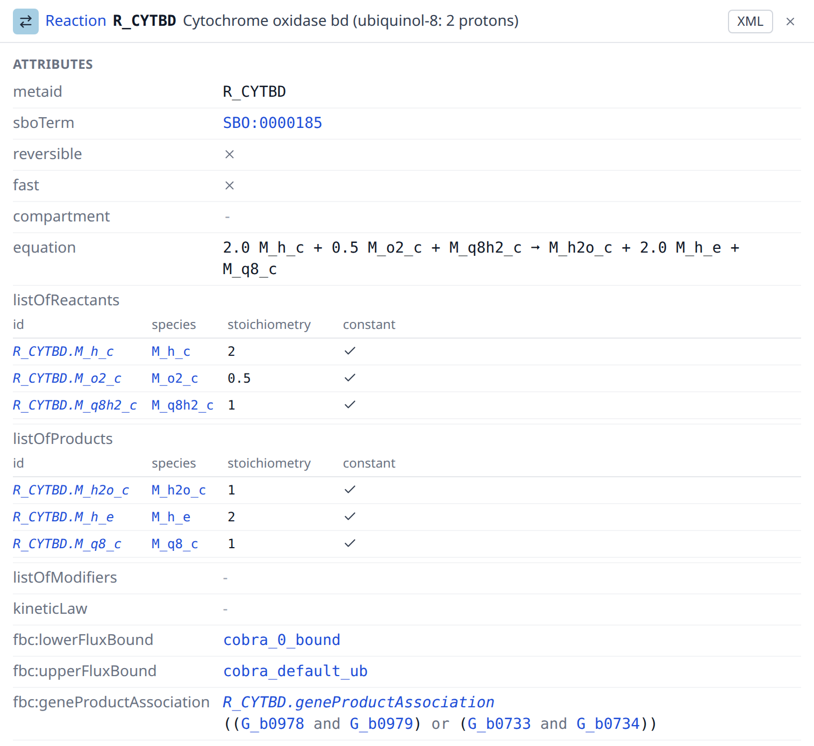

**Links** answers where an element is used. "References" lists the elements this element names, "Referenced by" lists the elements which name it, and both are grouped by the kind of the link: the compartment of a species, the reactants of a reaction, the variable of a rule, the units of a parameter, the elements a formula uses, and so on. Every link starts at the element which carries the reference, so a reaction names its species references and each of them names its species. The groups of a reaction and of a species look across that step, which is the question a reader asks: the reactants of a reaction are the species it consumes, and a species lists the reactions which consume, produce or modify it. The species references themselves are listed in the attributes of their reaction, and their own inspector shows both of their links. The formula of a reaction is looked across the same way: the reaction names its [kinetic law](reference/kineticlaw.md) and lists what the formula reads under "math", and a species or a parameter the formula reads lists the reaction there, not the kinetic law; a [transition](reference/transition.md) and the function terms of its table are shown alike. The genes of a reaction are looked across its [gene product association](reference/geneproductassociation.md): the reaction lists the [gene products](reference/geneproduct.md) its tree names, and a gene product lists the reactions which need it, each of them once, which is the question a reader of a reconstruction asks of a gene. An [uncertainty](reference/uncertainty.md) names the element whose value it describes, so the link leads back from the measures to the value. An element which the file nests in another one and which carries no id of its own is named after that element and its place in it, `Reaction1.kineticLaw`, `Start.trigger`, `Start.kp` for an assignment of the event `Start`, `R_PFK.G_b3916` for a gene of the association of `R_PFK` or `biomass_max.EX_biomass` for a flux objective, where its meta id would say nothing, and the name is set in italics wherever it stands, as a name the report gives and not an id of the file. The [link kinds](reference/links.md) page explains every kind, and hovering the label of a group shows its explanation. Every entry is a link which selects that element, so a model can be walked through along its references. A group with more than 50 entries shows the first 50 and a button for the rest, which matters for a compartment of a genome scale model.

**Annotations** shows the metadata of the element.

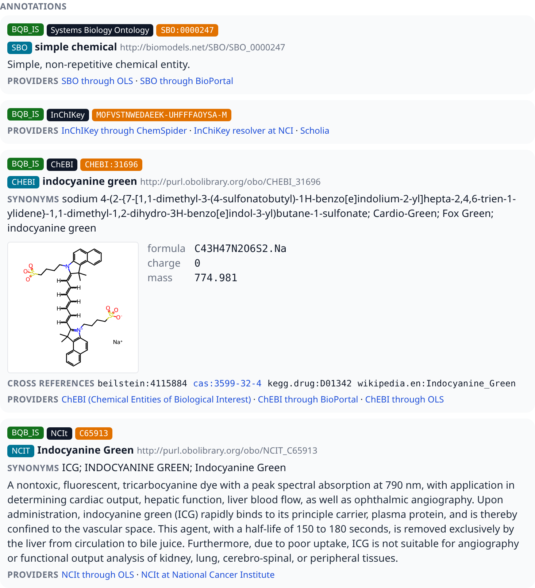

The annotations themselves are the controlled vocabulary terms of the element, one block per term, and a term shows one card per resource. Every card starts with three badges: the [qualifier](reference/concepts.md#qualifier) of the term, which says how the element relates to the resource, the [collection](reference/concepts.md#collection) of identifiers.org the resource belongs to, a link to the home page of the collection, and the [identifier](reference/concepts.md#identifier) of the entry, a link to the entry at the primary provider of the collection. A term which further terms qualify, which the specification allows at any depth, shows them indented below its cards. A term of the Systems Biology Ontology which the element carries is listed here as well.

Below the badges a card shows what the entry is. A term of an ontology shows its [ontology](reference/concepts.md#ontology), its label and its IRI, its first five [synonyms](reference/concepts.md#synonyms) with the rest behind "show all", its description and its [cross references](reference/concepts.md#cross-references) to other databases. A compound of ChEBI adds its structure, its [formula](reference/concepts.md#formula), its [charge](reference/concepts.md#charge) and its [mass](reference/concepts.md#mass), so that the charge and the formula a model assumes for a species can be compared with the compound it names. A protein of UniProt shows its [name](reference/concepts.md#name), its [organism](reference/concepts.md#organism), its [genes](reference/concepts.md#genes), the [length](reference/concepts.md#length) of its sequence and its [function](reference/concepts.md#function). The last line of every card lists the [providers](reference/concepts.md#providers) of the collection, the other web sites which show the entry. Every label of a card opens its explanation.

The report does not carry this information, it asks its backend for it when the card is shown: the collection, the identifier and the providers come from the registry of [identifiers.org](https://identifiers.org), a term of an ontology from the [Ontology Lookup Service](https://www.ebi.ac.uk/ols4) of the EMBL-EBI, a compound from [ChEBI](https://www.ebi.ac.uk/chebi/) and a protein from [UniProt](https://www.uniprot.org/). The server keeps a resolved resource for a day, and the answers of these services for 30 days on disk (the registry for a day), so that a resource is not looked up again with every report; the browser keeps a resource for a day, one whose term a service does not know for 10 minutes and one whose service could not be reached not at all, and a structure for 30 days. A card shows its badges at once and fills in while the backend answers, and the identifier is always a link to the entry, also where nothing could be resolved.

A card says when something is wrong with its resource: a warning below the badges says that the web service does not know the term, that a resource is no url of identifiers.org and has no collection, or that the identifier does not match the pattern of its collection, and a resource whose service did not answer says that it could not be resolved. Long lists of terms and of resources are cut off, with one button which shows the rest and one which resolves the rest: the cards of an element resolve on their own up to 100 resources, so that a reaction of a genome scale model with hundreds of them does not send hundreds of requests.

The notes of the element follow where it has any, rendered as the XHTML the author wrote, and the history of the SBML encoding last: who created it, with which organization and mail address, when it was created and when it was modified.

The "XML" button in the header replaces the three sections by the SBML of the element as it stands in the file, with a button which copies it. The XML is highlighted, the names of the elements and the values of the attributes in colour and the text of an element in bold, and a line longer than the inspector is wide wraps inside it, between the attributes or after a `/` of a url, its continuation indented below the start of the line. It is there for what a report cannot show better than the file itself: an annotation in a format the report does not read, an element of a package it does not support, or simply the exact text. The button is there for every element, including the document and the model, whose XML would be the whole file: for those two the view shows their annotation element alone, under a caption which says so, because that is where a tool writes what a file says about itself, and it says that the element carries no annotation where there is none.

## Validation

sbml4humans runs the consistency checks of [libsbml](https://sbml.org/software/libsbml/) on the document and shows the errors and warnings it finds where the elements they concern are shown. What the [validation](reference/concepts.md#validation) checks is explained in the reference.

The validation runs apart from the report: the report appears as soon as it is built, and the validation is requested for the same source once it is there. While it runs, the bar of the report shows a quiet chip "validating" with a spinner, and the tables carry no marks yet; when it is done, the counts, the marks and the lists appear without a reload. A validation which failed shows a gray chip "validation failed", whose tooltip carries the message of the failure, and the report stays as it is; a click on the chip selects the document, whose inspector shows the failure, and where the server sends its details, as the local server of `sbml4humans.show` does, they are behind "Show details". Loading another report stops the validation of the previous one.

A document with errors or warnings shows their counts as two chips in the bar of the report, a red one for the errors and an amber one for the warnings; a valid document shows none. A click on a chip selects the document, whose inspector lists them all. On a phone the chips keep their counts and leave out the words. A document which was not validated shows a gray chip "not validated" in their place, whose tooltip and the inspector of the document say why.

An element with an issue carries the mark of its worst severity in front of its id in the tables, and hovering the mark shows the rule and the message of every issue of the element. The mark is no stop of the keyboard, the row is: a screen reader reads the severity and the issues with the focused row, and Enter opens its inspector, which lists them. The issue of an element without a row of its own, the kinetic law of a reaction or the trigger of an event, marks the row which holds it, and the tooltip and the inspector of that row name the element it concerns. A table whose type has issues in the shown model keeps the place of the mark empty in the other rows, so that the ids stand under each other. The type bar marks a type which has issues in the shown model with the same mark after its count. The document, the model and the external model definitions have no row: their entry in the type bar carries the mark, the model also for the issues of its lists.

[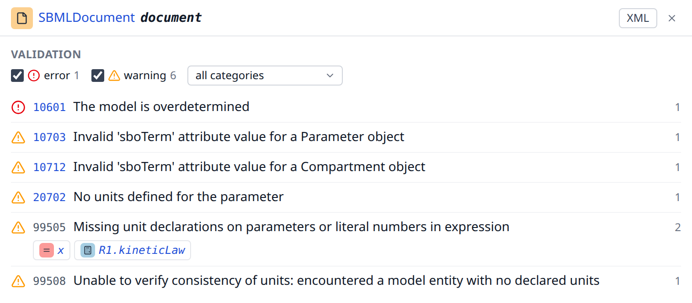](images/inspector-validation.png)

The inspector of an element lists its issues above its attributes, the errors first: the short message of libsbml, the number of the rule, the category and the severity, and the full message behind "more". The number of a rule opens the explanation which states the text of that rule where the [reference](reference/index.md) cites it. The inspector of the document lists every issue of the document, one group per rule with the number of its issues, and a group opens to links to the elements it concerns, the first 100 of them before a "show all". Checkboxes filter the list by severity and, where the issues fall into several categories, a select by category; filters which leave no issue say so.

libsbml checks in stages and stops after the first stage which finds an error: a document with an error of its identifiers shows none of its unit warnings until that error is fixed.

libsbml reports where in the file an issue is, not which element it concerns, so the report gives an issue to the element which starts closest before that position, and to the document when none does. For a document of the comp package libsbml instantiates the submodels to check them and says itself that its line numbers are unreliable, so the element of such an issue can be the wrong one.

The [external model definitions](reference/externalmodeldefinition.md) of a document are checked only against the documents which are part of the report, the other entries of its archive; the validation reads no other file and fetches no url.

Every validation runs in a process of its own on the server, with limits of time and memory, so that a model which takes long to check delays neither its own report nor the reports of other readers. A document is not validated, and says why, when:

- **the expanded size is too large**: to check a model of the comp package libsbml instantiates every submodel of its main model and the submodels of those in turn, also across the entries of an archive, so the work grows with the product of the submodels of every level. A document with submodels which expands to more than 10,000 elements, its own and those of every instance, is not checked; the inspector lists only the errors libsbml finds while it reads the file. A document without submodels is never skipped for its size.
- **the time ran out**: a validation may take 60 seconds, the wait for its turn included, after which it is stopped; the entries of an archive it had checked by then keep their issues.
- **the memory ran out**: the process of a validation may reserve 2 GiB of memory. Close to that limit libsbml may also end a check early without saying so and report fewer issues than the document has.
- **the check crashed**: the process of the validation ended abnormally for another reason than its limits, for instance when the operating system ended it; the entries of an archive it had checked by then keep their issues.
- **the server was busy**: the server runs a few validations at a time and lets a few more wait, a further one is answered at once without a check. A reader who requests more validations than the server allows one address in a short time is answered the same way. Reloading the report later tries again; a file or pasted content is not part of the address of the page and has to be loaded again.
- **the answer left it out**: the answer of the validation holds no result and no reason for the document, which is then not read as valid either.

These limits keep the server responsive, they do not make a validation complete: a document which was validated shows what libsbml found within them.

## Explanations

Every name the report shows is explained: a type, an attribute, the header of a column and the kind of a link. Hovering the name shows the one sentence which says what it is, and a click on it opens the explanation itself, in a dialog over the report.

[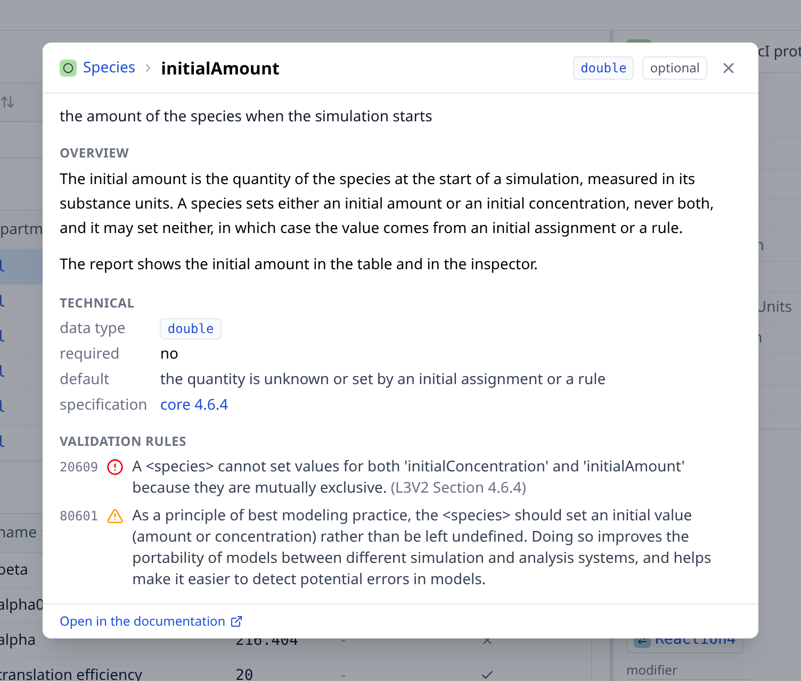](images/help-dialog.png)

The labels of the inspector open it: the label of a row of the attributes, the name of the type in the header, the heading of a group of links and the header of a column of a small table. Where a click on the name already does something else, a small help icon next to it opens the dialog instead. In the header of a column of an element table, where a click sorts the table, the icon appears while the pointer rests on the header or the keyboard is in it; next to the heading of a table it is always there. A name the glossary does not explain stays plain text.

The dialog shows, one part under the other and each of them only where the entry has it:

- the one sentence of the tooltip, which leads the rest
- **Overview**, what the thing is and what the report does with it, the text of its page in the [reference](reference/index.md)
- **Technical**, the low level: the [data type](reference/datatypes.md) of the value, whether the specification requires the attribute, what holds when the file does not set it, and the section of the specification which defines it, linked to that specification
- **Validation rules**, the rules of the specification which concern the entry: the number a validator reports, whether it is an error or a warning, and the message, all three as libsbml states them, which is the library that judges the file of a reader
- **Attributes**, for a type, every attribute it carries with its data type, whether it is required and its one sentence, and behind them the attributes every element carries
- **Related elements**, the entries which are read next to this one
- the link which opens the entry on its page of the reference

[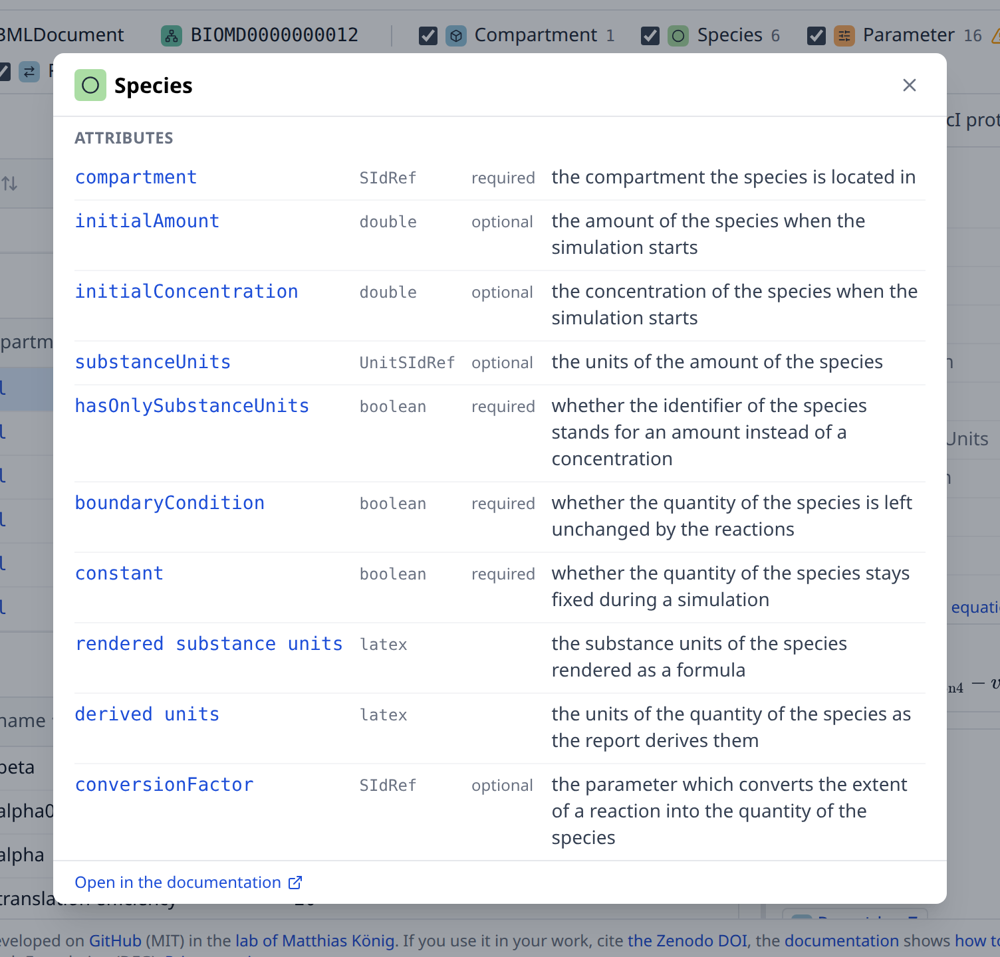](images/help-type.png)

The dialog is a small reference of its own: the type in front of an attribute, the badge of its data type, a row of the attributes, a related element and every name the text links open the explanation of what they name, and the back button of the browser walks back through the entries which were opened. Each of them is a link like every other, so a ctrl-click or a middle click opens an explanation in a new tab. `Esc` and the cross close the dialog and give the focus back to the label which opened it.

The open explanation is part of the url of the report, as the parameter `help`, so an explanation can be linked and a reload keeps it open. A report which was opened from python explains itself without a network: the explanations ship with the application.

## Archives and models

The bar at the top says which file and which model the report shows: the entry of the COMBINE archive, the model inside it, the level and the version of SBML and the packages the file declares. A model which was not submitted as an archive is wrapped in one by the backend, under a location the reader never chose; that single entry is not written in the bar, which then begins with the model.

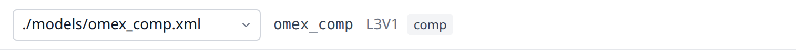

An archive with more than one SBML entry offers its entries for selection, named by their location in the archive. The report opens the master entry of the manifest when that entry has a report of its own, and the first entry otherwise; an archive does not have to mark a master entry, and `CompModels`, one of the example archives, marks none. A file which uses the comp package can hold model definitions next to its model; they are offered in the same way, with "(definition)" behind the id of a model definition, and the report opens the model of the document first. A [submodel](reference/submodel.md) is an element of the model which instantiates it, and the model definition it instantiates is one of the models offered here.

Switching the entry or the model selects the model which comes into view, because the element which was selected belongs to the model it was selected in. The search and the filter of types stay as they are.

### Models of other documents

A model of the comp package can instantiate a model of another file through an [external model definition](reference/externalmodeldefinition.md), which names that file by its `source`. The report follows the definition when it was given the file: when the source is a relative location and the file is another entry of the same COMBINE archive, as in the example archives `CompModels`, `icg_model` and `omeprazole_model`. The [replacements](reference/replacedelement.md), the [deletions](reference/deletion.md) and the [ports](reference/port.md) which reach into such a submodel then end at the element they name in the other entry. A link into another entry shows the file name of that entry behind the element, and following it opens the report of that entry with the element selected; the element lists the link under "Referenced by", with the file name of the entry it comes from.

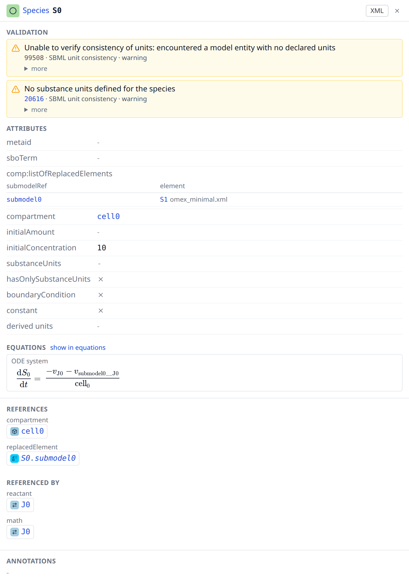

The inspector of an external model definition says how far it was followed: the status, the entry and the model it resolves to, and whether the md5 checksum of the definition is the checksum of the entry. A checksum which does not match is stated and the definition is still followed, because the file in the archive is the one the model is used with. A [submodel](reference/submodel.md) which instantiates an external model definition links the model behind it, or says why there is none.

The report never fetches a file. A source which is a URL is shown as it is and marked as a remote source, so that the time a report takes does not depend on another server and a model cannot make the server request an address. An SBML file which is uploaded on its own has no file next to it, so its external model definitions are not followed and its references end at the submodel; put the files into one COMBINE archive to see them resolved. The examples which are single files are read from their directory on the server, which is why `comp_deletion` and `icg_body` show the files they name as further entries.

## On a phone

A window narrower than 768 px, a phone, has no room for the tables and the inspector next to each other, so the report shows one of them at a time. It opens with the tables and without a selected element. A tap on a row shows the inspector in place of the tables, the arrow at the start of its header and the back button of the browser return to the tables where you left them. The model and the document are opened from their marks in the type bar.

[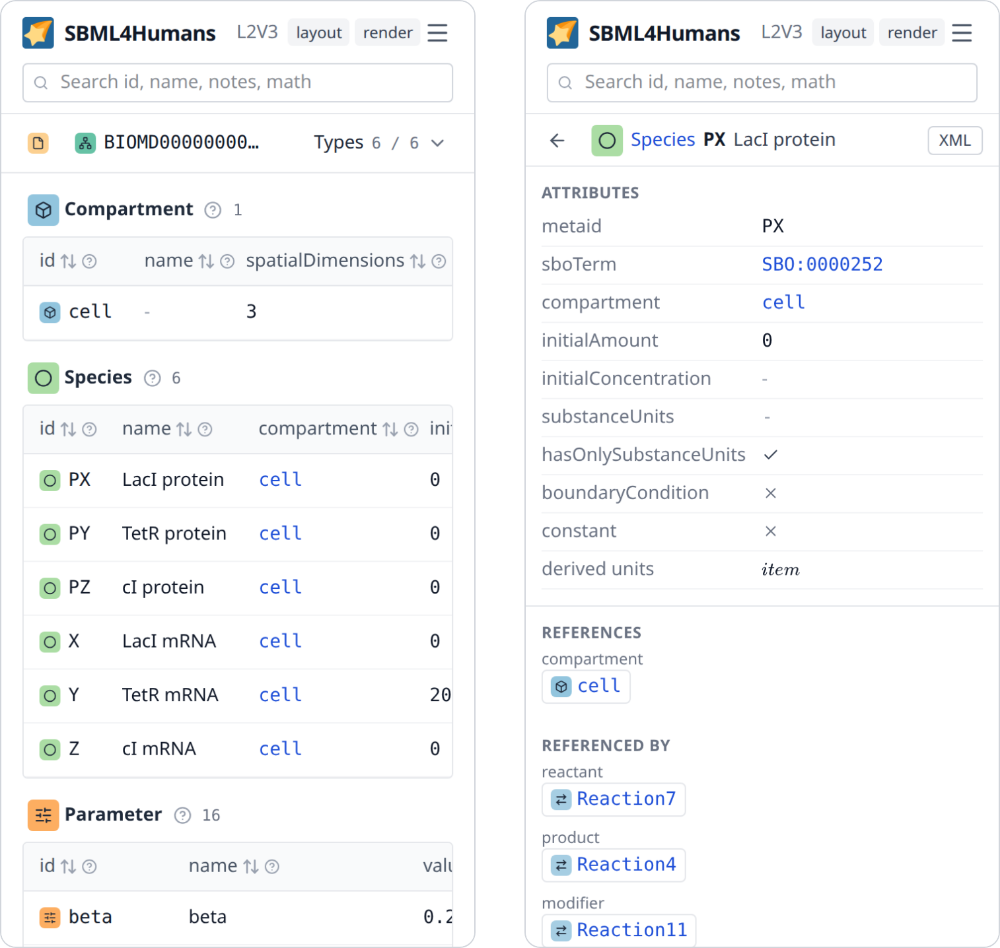](images/report-phone.png)

The type bar is one row: the types are behind the button which says how many of them the tables show, and the links of the app bar are behind its menu button. The search has a row of its own. The footer is left to the home page and the examples page.

A table which is wider than the window scrolls sideways inside its frame, and the id of every row stays in view while it does, in every window: the column of the ids is pinned to the left edge of the table. On a phone a long id is cut off in the table, the inspector shows it whole. The explanation of a name fills the window.

## The url of a report

The state of a report is part of its address, so a report can be linked in the state it is in: a selected element, a search, a filter of types, the view of the equations, one entry of an archive and one model of a document.

| parameter | meaning |
| --- | --- |
| `pk` | the selected element, given by its [primary key](reference/concepts.md#primary-key), which the report builds for every element because not every element of SBML has an id |
| `q` | the text of the search |
| `types` | the types the tables show, separated by commas; without the parameter every type is shown |
| `view` | `equations` for the [equations](#the-equations) of the model in place of the tables; without the parameter the tables are shown |
| `help` | the entry whose explanation is open, given by its key, `types/Species`, `types/Species/initialAmount`, `links/compartment`, `datatypes/SIdRef` or `concepts/derivedUnits` |
| `entry` | the location of the SBML entry inside the COMBINE archive |
| `model` | the id of the model or of the model definition |
| `url` | the address the model was downloaded from, for a report which was loaded from a url |
| `upload` | the id of an upload of another tool, for a report which was loaded from an upload; the upload is kept for 24 hours |

Selecting an element adds a step to the history of the browser, so the back button walks back through the elements you looked at. The model a report selects when it opens adds none. Typing in the search box does not, so the back button does not step through every keystroke.

## Feedback

"Feedback" in the bar at the top opens a new issue of the [repository](https://github.com/matthiaskoenig/sbml4humans/issues) on GitHub, with what a maintainer asks first already written: the version and the commit of the application, the page and the browser. For an example and for a model which was loaded from a url the issue names the model and the state of the report, so that whoever reads it opens what you saw. For a file of your own it names neither the file nor the selected element; nothing is sent before you submit the issue, and the text can be changed before that.

The footer of every page says which build is running: the version, which links the release on GitHub with its release notes, and the commit it was built from.
